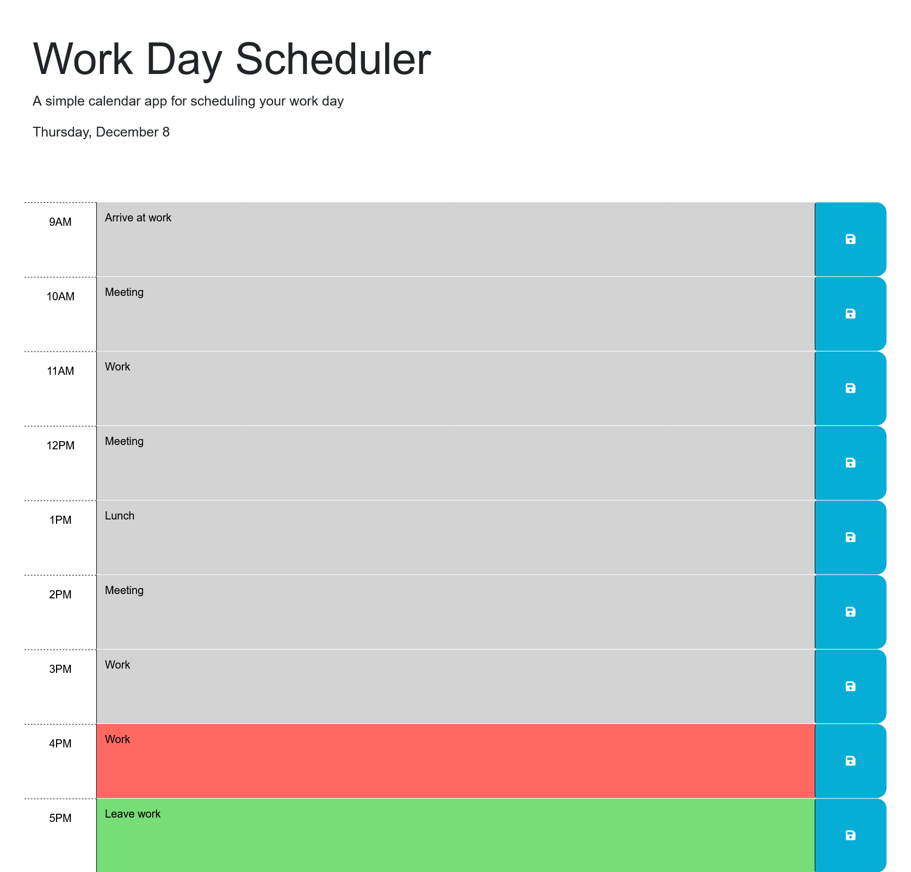

# Daily Planner

## Description

This tool allows people to plan out their day from 9 AM to 5 PM, with functionality to clearly indicate past, present, and future times, as well as save plans on local storage so the schedule is kept even after the page is closed. The header also indicates the current date to help the user make sure they're planning for the correct day.

## Screenshot

## Link
https://joshmusto.github.io/05-daily-planner/